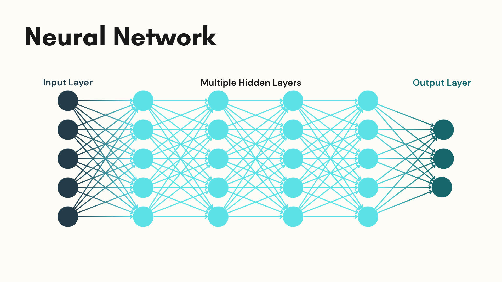

# The Effect of Convolutional Kernel Size on Handwritten Character Recognition Accuracy
### By: Om Kanabar

*This project is distributed under a separate license agreement. By using, copying, modifying, or distributing any part of this repository, you agree to the terms and conditions of that license.*

## A few key terms

1. **Neural Network**: A neural network is a computer program that is based on the human brain. This works by learning patterns from data. A neural network modifies its connections to learn. A neural network can recognize images or understand speech, or even make a prediction. Each hidden layer in the neural network will perform a mathematical operation to help it make its prediction. (See Fig 1)

---
Fig. 1 Neural Network Visualization. Source: Om Kanabar

---

2. **Convolutional Neural Network (CNN)**: A type of neural network that is more accurate 

## A bit about this project

This project deals with how the kernel size changes affect the accuracy of Convolutional Neural Networks, which are made for recognizing handwritten characters using the EMINST dataset. This experiment intends to find out how different kernel sizes influence learning efficiency and classification performances since several models will be trained with different kernel sizes.